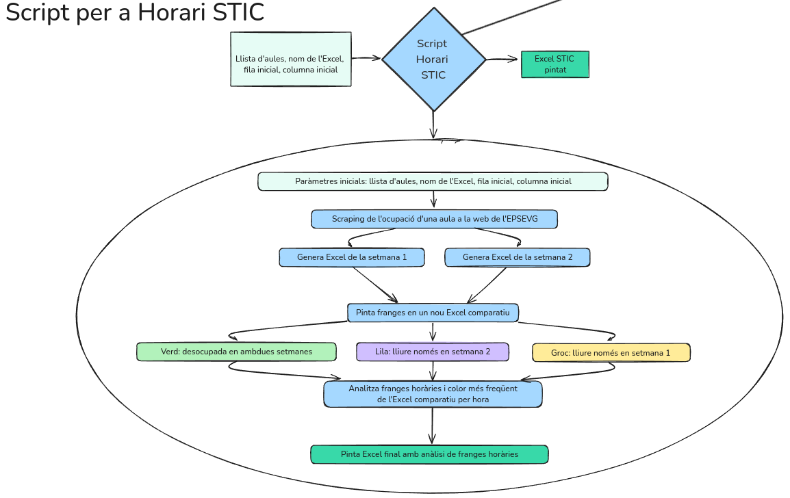
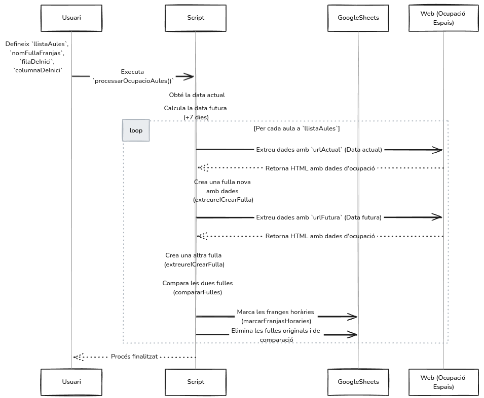
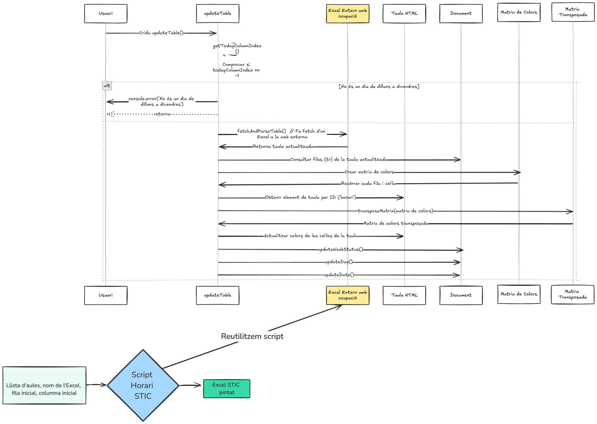

# ClassroomOccupancyTracker_UPC-STIC

## Documentation of the Classroom Occupancy Management Script

This script is designed for **EPSEVG ServeisTIC** to manage and visualize classroom occupancy within a Google Sheets document. It marks time slots based on occupancy status at a Google Drive excel, helping track the usage of classrooms across week s1 and s2.

### Author

- **Name:** Adrián Borrego
- **Date:** 09/23/2024

---

### Description

The script follows these steps:

1. **Retrieves occupancy data** for each classroom for two weeks (current and next week).
2. **Compares the occupancy data** for a classroom between the two weeks.
3. **Colors the cells** in a Google Sheets document based on the comparison results:
   - **Green:** Classroom is free in both weeks.
   - **Yellow:** Classroom is free only in the first week (S1).
   - **Purple:** Classroom is free only in the second week (S2).
   - **White:** Classroom is occupied in both weeks.




Additionally, with the script we have the ability to **scrape data from public Google Sheets**, allowing for automatic updates and table rendering in web frontends that can visualize this information dynamically.

---

### Web Scraping and Public Google Drive Integration

One use for the main script is that we can use the script to integrate **Google Drive** by creating a **public Google Sheets document** with any front-end that has a table and needs to be painted with classroom occupancy. By setting the file to public and sharing the web link, we are able to scrape the occupancy data directly from this excel web. This data can then be processed and visualized, providing real-time updates for classroom occupancy.

The ability to scrape a public Google Sheet and render tables is especially useful for frontends that require dynamic visualizations. This feature allows the occupancy data to be consistently up-to-date and easily shareable via web interfaces.

Like for example the proposed FrontEnd at web directory:



---

### Global Variables (INPUTS)

- `llistaAules`: List of classrooms to be processed.
- `nomFullaFranjas`: Name of the sheet where the occupancy will be drawn.
- `filaDeInici`: Starting row for coloring.
- `columnaDeInici`: Starting column for coloring.

### Functions

#### `processarOcupacioAules()`

Main function that handles the entire process: data retrieval (scraping), occupancy comparison, and coloring of results in the Google Sheet.

- Generates URLs to retrieve occupancy data for both weeks.
- Extracts occupancy information for the classrooms.
- Compares data between weeks and marks time slots.
- Deletes temporary sheets generated during the process.

#### `extreureICrearFulla(url)`

Extracts the occupancy data from a URL (Google Sheets) and creates a new sheet with the extracted information.

- Detects if the data belongs to S1 or S2.
- Creates a new sheet with the corresponding name if it doesn’t exist.

#### `compararFulles(nomFulla1, nomFulla2)`

Compares two occupancy sheets (S1 and S2) and generates a new sheet with the comparison results.

- Colors the results with the corresponding colors: green, yellow, purple, white.

#### `marcarFranjasHoraries(nomFullaComparacio, fila, columna)`

Marks the time slots on the comparison sheet, assigning colors based on the occupancy status.

- Defines the specific time slots.
- Applies background colors based on the comparison results.

#### `eliminarFullaPerNom(nomFulla)`

Deletes a sheet from the document identified by its name.

#### `getColumnLetter(baseCol, index)`

Returns the letter of the column corresponding to the given index, starting from a base column.

---

### Time Slot Sequence

- 08:30 - 10:30
- 10:30 - 12:30
- 12:30 - 14:30
- 15:00 - 17:00
- 17:00 - 19:00
- 19:00 - 21:00

---

### Usage Example

```javascript
const llistaAules = ['VGA105', 'VGA108', 'VGA109'];
const nomFullaFranjas = 'sheet_we_want_to_paint';
var filaDeInici = 5;
var columnaDeInici = 'C';

// Execute the occupancy process
processarOcupacioAules();


